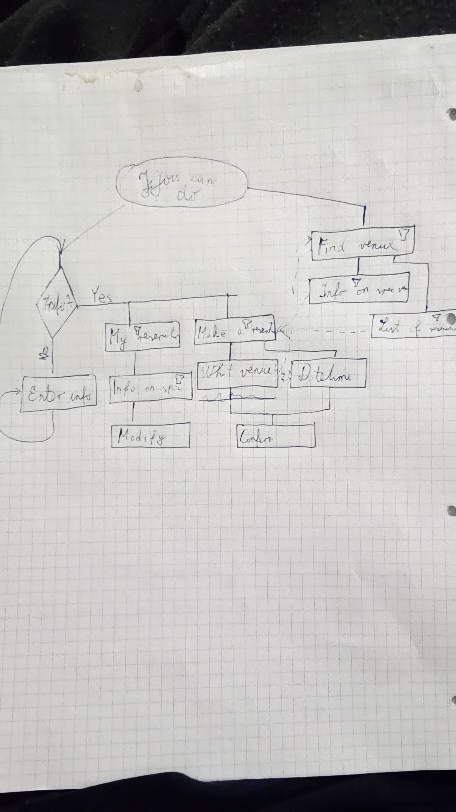

#  


## There will be two main project:
* Database project with:
  * OQPYManager 
  * Asp.net core 1.1
  * SQL db 
  * Entity core framework
  * Rest api:
    *  general form of the rest api:  ``` https://OQPY.com/api{Version number}/{Methode Name}?{param1="value1"}?{param2="value2"}?...?{paramN="valueN"} ```
    *  List of all api methodes can be found in [Rest api docs](RESTAPIDocs.md)
* Bot project with:
  * OQPYBot 
  * Asp.net (not core, because bot framework is not supported in .net core :( ... )
  * Will be connected with Database project with rest api

 ### Why are there two project? why not just one?
  * Bot framework isn't compatable with asp.net core
  * Micro service arhitecture is the future
  * Easyer debuging... maybe... I'd hope so :)
  * Easyer splitting of jobs: 
    * Josip - RestApi and db
    * Branimir - RestApi and Bots


 
